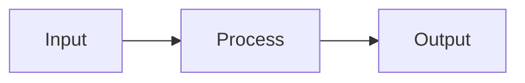

# GROMOS-RS Documentation

This directory contains the MkDocs-based documentation for GROMOS-RS.

## Building Documentation

### Prerequisites

```bash
pip install -r requirements.txt
```

Or using a virtual environment:

```bash
python -m venv venv
source venv/bin/activate  # On Windows: venv\Scripts\activate
pip install -r requirements.txt
```

### Build and Serve Locally

```bash
# Serve with live reload (recommended for development)
mkdocs serve

# Open browser to http://127.0.0.1:8000
```

### Build Static Site

```bash
# Build HTML site to site/ directory
mkdocs build

# Build with strict mode (fail on warnings)
mkdocs build --strict
```

### Deploy

```bash
# Deploy to GitHub Pages
mkdocs gh-deploy
```

## Documentation Structure

```
docs/
├── index.md                 # Homepage
├── changelog.md             # Version history
│
├── getting-started/         # Quick start guides
│   ├── installation.md      # Installation instructions
│   └── quick-start.md       # First simulation tutorial
│
├── user-guide/              # User documentation
│   ├── introduction.md
│   ├── running-simulations.md
│   ├── input-files.md
│   ├── output-files.md
│   ├── free-energy.md
│   ├── enhanced-sampling.md
│   └── analysis.md
│
├── architecture/            # Architecture documentation
│   ├── overview.md          # Ecosystem overview
│   ├── mdplusplus.md        # MD++ architecture
│   ├── gromosplusplus.md    # GROMOS++ architecture
│   ├── gromos-rs.md         # GROMOS-RS architecture
│   ├── comparison.md        # Feature comparison
│   └── gaps.md              # Gap analysis (what's missing)
│
├── reference/               # Technical reference
│   ├── integrators.md
│   ├── force-field.md
│   ├── constraints.md
│   ├── thermostats-barostats.md
│   ├── advanced-sampling.md
│   ├── file-formats.md
│   └── cli-tools.md
│
├── api/                     # API documentation
│   ├── overview.md          # API overview
│   ├── rust.md              # Rust API (rustdoc)
│   ├── core.md              # Core modules
│   ├── integration.md       # Integration algorithms
│   ├── interactions.md      # Force calculations
│   └── io.md                # I/O modules
│
├── development/             # Developer documentation
│   ├── contributing.md
│   ├── building.md
│   ├── testing.md
│   ├── performance.md
│   └── roadmap.md
│
├── migration/               # Migration guides
│   ├── from-mdplusplus.md
│   ├── from-gromosplusplus.md
│   └── compatibility.md
│
├── stylesheets/             # Custom CSS
│   └── extra.css
│
└── javascripts/             # Custom JavaScript
    └── mathjax.js           # Math rendering
```

## Writing Documentation

### Markdown Extensions

This documentation uses the following extensions:

#### Admonitions

```markdown
!!! note "Title"
    This is a note admonition.

!!! warning
    This is a warning.

!!! tip
    This is a helpful tip.

!!! danger
    This is a danger/error message.

!!! info
    This is an informational message.

!!! success
    This indicates success.
```

#### Code Blocks

````markdown
```rust
fn main() {
    println!("Hello, world!");
}
```

```bash
cargo build --release
```
````

With line numbers and highlighting:

````markdown
```rust linenums="1" hl_lines="2 3"
fn main() {
    let x = 5;
    println!("x = {}", x);
}
```
````

#### Tabs

```markdown
=== "Tab 1"

    Content for tab 1

=== "Tab 2"

    Content for tab 2
```

#### Math

Inline: `\( E = mc^2 \)`

Display:

```markdown
\[
    E_{LJ} = 4\epsilon \left[ \left(\frac{\sigma}{r}\right)^{12} - \left(\frac{\sigma}{r}\right)^6 \right]
\]
```

#### Tables

```markdown
| Column 1 | Column 2 | Column 3 |
|----------|----------|----------|
| Cell 1   | Cell 2   | Cell 3   |
| Cell 4   | Cell 5   | Cell 6   |
```

#### Mermaid Diagrams

````markdown

````

### Style Guide

- Use **bold** for UI elements and important terms
- Use `code` for filenames, commands, and code snippets
- Use *italics* sparingly for emphasis
- Keep sentences concise and clear
- Use active voice
- Include examples where possible

### Links

Internal links (within docs):

```markdown
[Link text](../other-page.md)
[Link to section](page.md#section-heading)
```

External links:

```markdown
[Rust](https://www.rust-lang.org)
```

## Updating Navigation

Edit `mkdocs.yml` to modify the navigation structure:

```yaml
nav:
  - Home:
    - Overview: index.md
    - Installation: getting-started/installation.md
  - User Guide:
    - Introduction: user-guide/introduction.md
```

## Testing

Before committing documentation changes:

1. **Build locally**: `mkdocs serve`
2. **Check all links**: Navigate through all pages
3. **Verify code examples**: Ensure code blocks are correct
4. **Check formatting**: Ensure consistent style
5. **Build strict**: `mkdocs build --strict` (fails on warnings)

## Deployment

### GitHub Pages

Documentation is automatically built and deployed to GitHub Pages when changes are pushed to the main branch.

Manual deployment:

```bash
mkdocs gh-deploy
```

### Read the Docs

Configuration in `.readthedocs.yml` at the repository root.

Documentation builds automatically on push to main branch.

## Contributing

See [Contributing Guide](development/contributing.md) for guidelines on:

- Writing clear documentation
- Adding examples
- Keeping docs up-to-date
- Documentation standards

## Issues

Report documentation issues at:
https://github.com/yerkoescalona/gromos-rs/issues
