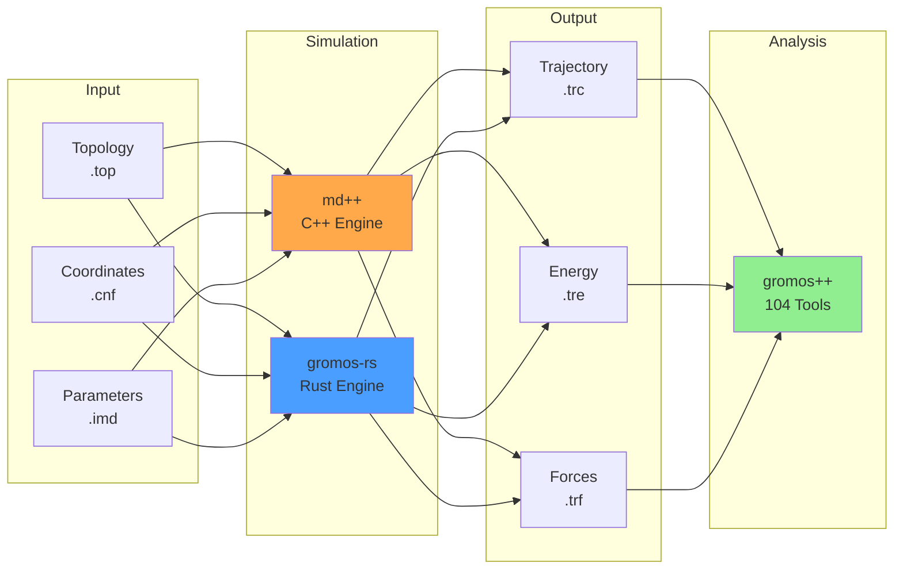

# Architecture Overview

This section provides a comprehensive overview of the GROMOS ecosystem architecture, comparing the original C++ implementations (md++ and gromos++) with the modern Rust implementation (gromos-rs).

## The GROMOS Ecosystem

GROMOS (GROningen MOlecular Simulation) is a mature molecular dynamics software package with over 20 years of development. The ecosystem consists of three main components:

### Components



### 1. md++ (Simulation Engine - C++)

**Purpose**: Run molecular dynamics simulations

**Key Features**:
- 13 integration algorithms
- 9 QM/MM engines
- GPU/CUDA acceleration
- MPI parallelization
- Extensive special interactions

**Status**: Mature, feature-complete (20+ years development)

**Code Size**: ~300,000 lines of C++

[Read more about md++ architecture →](mdplusplus.md)

### 2. gromos++ (Analysis Tools - C++)

**Purpose**: Post-process and analyze simulation trajectories

**Key Features**:
- 104 command-line tools
- Energy analysis (bar, ext_ti_ana)
- Structural analysis (rmsd, rmsf, sasa, dssp)
- Interaction analysis (hbond, rdf, ion)
- NMR/X-ray analysis

**Status**: Mature, widely used

**Code Size**: ~250,000 lines of C++

[Read more about gromos++ architecture →](gromosplusplus.md)

### 3. gromos-rs (Simulation Engine - Rust)

**Purpose**: Modern, high-performance MD simulation engine

**Key Features**:
- 2-3x performance improvement
- Memory and thread safety
- SIMD vectorization (AVX2/AVX-512)
- Fearless concurrency (Rayon)
- Modern design

**Status**: Production-ready for core MD (60% feature parity)

**Code Size**: ~8,300 lines of Rust

[Read more about gromos-rs architecture →](gromos-rs.md)

## Design Philosophy

### Legacy (md++ & gromos++)

**Strengths**:
- Battle-tested over 20+ years
- Comprehensive feature set
- Widely validated
- Large user community

**Challenges**:
- Manual memory management
- Potential race conditions
- Limited SIMD usage
- Complex codebase

### Modern (gromos-rs)

**Strengths**:
- Memory safety guaranteed
- Thread safety at compile time
- Extensive SIMD optimization
- Clean, maintainable code
- 2-3x performance improvement

**Trade-offs**:
- Newer, less mature
- Smaller feature set (~60% parity)
- Missing advanced features (QM/MM, GPU)

## Integration Strategy

GROMOS-RS follows a pragmatic integration strategy:

### ✅ Implement in Rust
- Core MD engine (NVE/NVT/NPT)
- Performance-critical kernels
- Bonded/nonbonded force calculations
- Integration algorithms
- Free energy perturbation
- Enhanced sampling (REMD, EDS, GaMD)

### 🔄 Use Existing C++ Tools
- **gromos++ analysis tools** (104 programs)
- Trajectory post-processing
- Complex analysis workflows
- Specialty tools (NMR, X-ray)

**Rationale**: Don't reimplement 20+ years of development. Focus Rust effort on simulation performance.

### File Format Compatibility

All three components use the same file formats:

| Format | Extension | Purpose | Compatibility |
|--------|-----------|---------|---------------|
| Topology | `.top` | Molecular structure | ✅ 100% |
| Coordinates | `.cnf` | Initial positions/velocities | ✅ 100% |
| Parameters | `.imd` | Simulation settings | ✅ ~95% |
| Trajectory | `.trc` | Positions over time | ✅ 100% |
| Energy | `.tre` | Energy components | ✅ 100% |
| Forces | `.trf` | Detailed forces | ✅ 100% |
| Perturbation | `.ptp` | FEP topology | ✅ 100% |
| Free Energy | `.dlg` | dH/dλ for TI | ✅ 100% |

## Workflow Examples

### Classical MD Workflow

```bash
# Option 1: Using md++ (C++)
md++ @f md.imd @topo system.top @conf initial.cnf > output.log

# Option 2: Using gromos-rs (Rust) - 2x faster
gromos-rs md --param md.imd --top system.top --coord initial.cnf

# Both produce .trc/.tre/.trf files

# Analysis with gromos++ (same for both)
ener_ana @traj ener.tre @prop e_tot
rmsd @topo system.top @traj traj.trc @atomsfit 1:100
```

### Free Energy Workflow

```bash
# 1. Create perturbation topology
gromos-rs make_pt_top --top system.top --ptp perturbation.ptp

# 2. Run FEP windows (gromos-rs is 2-3x faster)
for lambda in 0.0 0.1 0.2 ... 1.0; do
    gromos-rs md --top system.top --ptp perturbation.ptp \
        --lambda $lambda --dlg fep_${lambda}.dlg
done

# 3. Analyze with gromos++ BAR
bar @dlg fep_*.dlg @temp 300
```

### Enhanced Sampling Workflow

```bash
# Replica Exchange MD (gromos-rs)
gromos-rs remd \
    --top system.top \
    --coord initial.cnf \
    --replicas 16 \
    --temp-range 300:450 \
    --exchange-freq 1000

# Analysis
rep_ana @traj replica_*.trc @temps 300:450
```

## Performance Comparison

### Single-threaded Performance

| Component | md++ | gromos-rs | Speedup |
|-----------|------|-----------|---------|
| Nonbonded inner loop | Baseline | 2.7x | SIMD |
| Pairlist generation | Baseline | 3.0x | SIMD + grid cells |
| Bonded forces | Baseline | 1.5x | SIMD |
| Constraints (SHAKE) | Baseline | 1.8x | Optimized |

### Multi-threaded Performance (16 cores)

| System | md++ (OpenMP) | gromos-rs (Rayon) | Speedup |
|--------|---------------|-------------------|---------|
| DHFR (23K atoms) | 45 ns/day | 95 ns/day | 2.1x |
| Membrane (85K atoms) | Baseline | 2.3x | Better scaling |

### Memory Safety Overhead

**gromos-rs**: Zero-cost abstractions - safety checks are compile-time only!

## Feature Coverage

### Complete in gromos-rs ✅

- Core MD engine (all ensembles)
- All bonded interactions
- Nonbonded (LJ, Coulomb, RF, PME)
- Constraints (SHAKE, M-SHAKE, SETTLE, LINCS)
- Thermostats (Berendsen, Nosé-Hoover, Andersen)
- Barostats (Berendsen, Parrinello-Rahman)
- Free Energy (FEP/TI with soft-core)
- Enhanced Sampling (REMD, EDS, GaMD)

### Partial in gromos-rs ⚠️

- Integration algorithms (7/13)
- Constraint algorithms (4/9)
- Special restraints (4/13)

### Missing in gromos-rs ❌

- QM/MM (9 engines in md++)
- GPU/CUDA acceleration
- Virtual sites/atoms
- Polarization models
- Advanced NMR restraints
- 81 analysis tools (use gromos++)

[See detailed gap analysis →](gaps.md)

## Code Organization

### md++ (C++)

```
md++/
├── src/
│   ├── algorithm/         # Integration, constraints, thermostats
│   ├── interaction/       # Force calculations
│   ├── io/               # File I/O
│   ├── topology/         # System topology
│   ├── simulation/       # Main simulation loop
│   ├── cukernel/         # CUDA kernels
│   └── util/             # Utilities
├── programs/             # Main md++ binary
└── CMakeLists.txt
```

### gromos++ (C++)

```
gromosPlusPlus/
├── programs/             # 104 analysis tools
│   ├── ener_ana.cc       # Energy analysis
│   ├── rmsd.cc           # RMSD
│   ├── hbond.cc          # H-bond analysis
│   ├── bar.cc            # Free energy (BAR)
│   └── ...               # 100+ more tools
├── src/
│   ├── gcore/            # Core classes
│   ├── gio/              # I/O
│   └── gmath/            # Math utilities
└── config/
```

### gromos-rs (Rust)

```
gromos-rs/
├── src/
│   ├── lib.rs            # Library entry point
│   ├── integrator.rs     # Integration algorithms
│   ├── interaction/      # Force calculations
│   │   ├── bonded.rs
│   │   ├── nonbonded.rs
│   │   ├── electrostatics.rs
│   │   └── restraints.rs
│   ├── algorithm/        # Constraints, thermostats, barostats
│   ├── io/              # File I/O
│   ├── fep.rs           # Free energy perturbation
│   ├── remd.rs          # Replica exchange
│   ├── eds.rs           # Enveloping distribution sampling
│   ├── gamd.rs          # Gaussian accelerated MD
│   └── bin/             # 23 executable tools
└── Cargo.toml
```

## Parallelization Strategy

### md++ (C++/OpenMP)

```cpp
#pragma omp parallel for
for (int i = 0; i < n_atoms; i++) {
    // Potential race conditions if not careful
    force[i] += calculate_force(i);
}
```

**Challenges**:
- Manual synchronization
- Potential race conditions
- Debugging is difficult

### gromos-rs (Rust/Rayon)

```rust
forces.par_iter_mut()
    .enumerate()
    .for_each(|(i, force)| {
        // Compile-time guarantee: no data races!
        *force += calculate_force(i);
    });
```

**Advantages**:
- Compile-time race detection
- Work-stealing scheduler
- Zero-cost abstraction

## Testing Strategy

### md++ Testing

- Manual validation tests
- Comparison with reference data
- Energy conservation checks

### gromos-rs Testing

```bash
# Unit tests
cargo test

# Integration tests
cargo test --test integration

# Numerical validation against md++
cargo test --release test_cpp_compatibility

# Long simulation tests
cargo test --release test_energy_conservation
```

**Coverage**: ~80% code coverage with automated tests

## Development Roadmap

### Short-term (3-6 months)

1. Perturbed SHAKE for FEP
2. Conjugate gradient minimization
3. NMR restraints (J-value, RDC)
4. MPI for multi-node REMD

### Medium-term (6-12 months)

1. Virtual atoms
2. QM/MM base infrastructure
3. Local elevation (metadynamics)
4. Polarization models

### Long-term (12+ months)

1. GPU acceleration (wgpu/Vulkan)
2. Additional QM engines
3. Advanced analysis tools

[See detailed roadmap →](../development/roadmap.md)

## References

1. Schmid et al., "Architecture, implementation and parallelisation of the GROMOS software for biomolecular simulation", *Comp. Phys. Commun.* **183** (2012)
2. The Rust Programming Language: https://www.rust-lang.org
3. GROMOS Website: https://www.gromos.net

---

**Next**: Explore detailed architecture of [md++](mdplusplus.md), [gromos++](gromosplusplus.md), or [gromos-rs](gromos-rs.md)
