# GROMOS-RS Documentation

!!! warning "Educational Project - Not Production Ready"
    **gromos-rs is an educational reimplementation for learning purposes only.**

    - ⚠️ NOT intended for actual research or scientific work
    - 🚧 Under active development with known compilation issues
    - 📚 Based on gromosXX (md++) and gromosPlusPlus C++ implementations
    - 🔬 Requires several iterations before production readiness

    **For official GROMOS software**, visit: [www.gromos.net](https://www.gromos.net)

## What is GROMOS-RS?

GROMOS-RS is a modern, educational reimplementation of molecular dynamics components from the GROMOS suite, rewritten in Rust. This project aims to:

- **Learn**: Understand MD algorithms through Rust implementation
- **Unify**: Combine approaches from both md++ and gromosPlusPlus
- **Modernize**: Leverage Rust's performance and safety features
- **Educate**: Provide a codebase for studying MD simulation techniques

## Project Status

!!! info "Current Status: Early Development"
    This project is in early stages and is NOT suitable for production use.

### What Works
- ✅ Basic Rust/Python project structure
- ✅ CI/CD infrastructure (GitHub Actions)
- ✅ Developer tooling (rustfmt, clippy, black, ruff)
- ✅ GPL-2.0 licensing consistent with GROMOS

### What's Missing
- ❌ Many features have compilation errors
- ❌ Not validated against GROMOS reference implementations
- ❌ No performance benchmarks yet
- ❌ Incomplete documentation
- ❌ Missing critical MD features

### Known Issues
- ~140+ compilation errors when building with all features
- Missing type definitions in GPU/CUDA code
- Incomplete implementations in PME/MPI parallelization
- Unfinished EDS/REMD functionality

## Getting Started

!!! tip "Development Setup"
    For developers interested in exploring or contributing to this educational project:

=== "Installation"

    ```bash
    # Clone the repository
    git clone https://github.com/yerkoescalona/gromos-rs.git
    cd gromosXX

    # Build Rust components (note: many features have compilation errors)
    cd gromos-rs
    cargo build --features simd,mimalloc

    # Run tests
    cargo test --features simd,mimalloc
    ```

=== "Python Bindings"

    ```bash
    # Build Python bindings
    cd py-gromos
    python -m venv .venv
    source .venv/bin/activate  # Windows: .venv\Scripts\activate
    pip install maturin
    maturin develop
    ```

=== "CI/CD"

    ```bash
    # Run local CI checks
    make ci

    # Format code
    make fmt

    # Lint code
    make lint
    ```

## Architecture Overview

GROMOS-RS is an educational reimplementation inspired by the GROMOS ecosystem:

```mermaid
graph TB
    subgraph "Official GROMOS (C++)"
        MD["md++<br/>Simulation Engine"]
        GP["gromosPlusPlus<br/>Analysis Tools"]
    end

    subgraph "Educational Project (Rust)"
        RS["gromos-rs<br/>Learning Implementation<br/>⚠️ Not Production Ready"]
        PY["py-gromos<br/>Python Bindings"]
    end

    MD -.->|inspiration| RS
    GP -.->|inspiration| RS
    RS --> PY

    style RS fill:#ffcc00
    style PY fill:#ffcc00
    style MD fill:#90ee90
    style GP fill:#90ee90
```



### Relationship to Official GROMOS

| Component | Type | Purpose | Use For |
|-----------|------|---------|---------|
| **md++** (C++) | Official | Production simulations | Real research |
| **gromosPlusPlus** (C++) | Official | Analysis tools | Real research |
| **gromos-rs** (Rust) | Educational | Learning MD algorithms | Education only |
| **py-gromos** (Python) | Educational | Python API experiments | Education only |

!!! warning "Use Official GROMOS for Research"
    For actual scientific work, please use the official GROMOS software from [www.gromos.net](https://www.gromos.net)

## Documentation Structure

### For Developers
- **[Development Guide](development/contributing.md)**: Contributing guidelines
- **[Coding Style](development/coding-style.md)**: Rust/Python style guide
- **[CI/CD Guide](development/ci-cd.md)**: GitHub Actions workflows
- **[Pre-commit Hooks](development/pre-commit.md)**: Automated code quality
- **[Developer Tools](development/developer-tools.md)**: Tool reference

### Technical Documentation
- **[Naming Conventions](development/naming-conventions.md)**: Scientific naming (kT, pH, etc.)
- **[Binary Formats](development/BINARY_FORMATS.md)**: GROMOS file formats
- **[Tutorial Compatibility](development/tutorial-compatibility.md)**: GROMOS tutorial support

## Learning Goals

This educational project is designed to help you learn:

### Rust for Scientific Computing
- SIMD vectorization for performance
- Safe parallelization with Rayon
- FFI and Python bindings with PyO3
- Memory safety in compute-intensive code

### Molecular Dynamics Algorithms
- Integration schemes (Leap-Frog, Verlet)
- Force field calculations
- Constraint algorithms (SHAKE, SETTLE)
- Enhanced sampling methods

### Software Engineering
- CI/CD with GitHub Actions
- Comprehensive testing strategies
- Documentation with MkDocs
- Multi-language projects (Rust + Python)

## Community and Support

- **Issues**: [GitHub Issues](https://github.com/yerkoescalona/gromos-rs/issues)
- **Official GROMOS**: [www.gromos.net](https://www.gromos.net)

## License

**gromos-rs** is licensed under GPL-2.0, maintaining compatibility with the original GROMOS license.

- Copyright (C) 2025 Yerko Escalona
- Based on GROMOS software (Copyright by Biomos b.v. and GROMOS development team)
- See [LICENSE](../LICENSE) file for full text

## Citation

!!! warning "Not for Research Use"
    This is an educational project and should NOT be cited in scientific publications.
    Use official GROMOS software for research work.

If referencing this educational project, cite the original GROMOS papers:

```bibtex
@article{schmid2012,
  title={Architecture, implementation and parallelisation of the GROMOS software for biomolecular simulation},
  author={Schmid, Nathan and Christ, Clara D and Christen, Markus and Eichenberger, Andreas P and van Gunsteren, Wilfred F},
  journal={Computer Physics Communications},
  volume={183},
  number={4},
  pages={890--903},
  year={2012},
  publisher={Elsevier}
}
```
